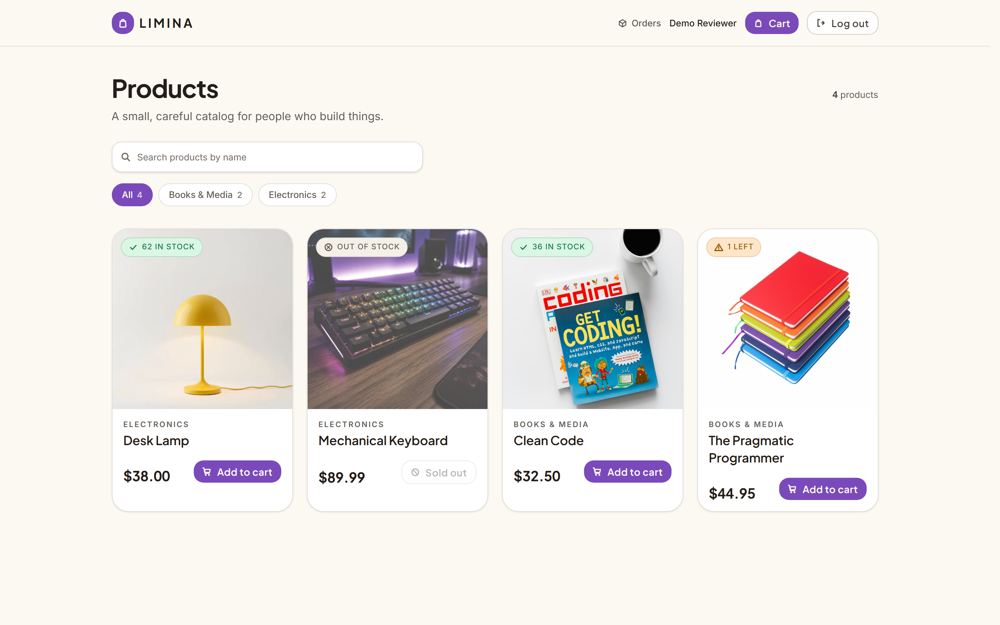
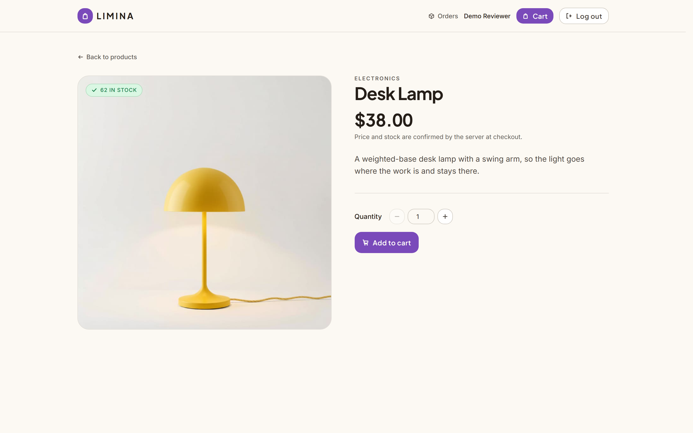
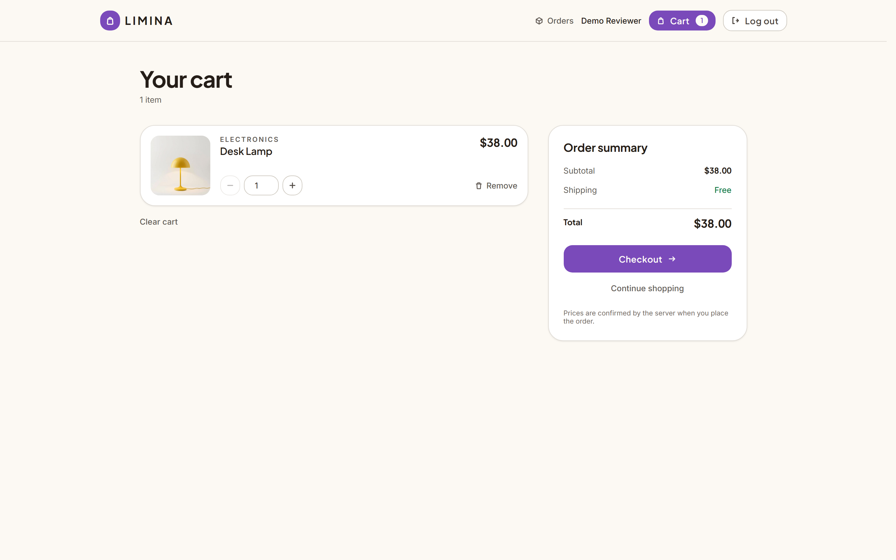
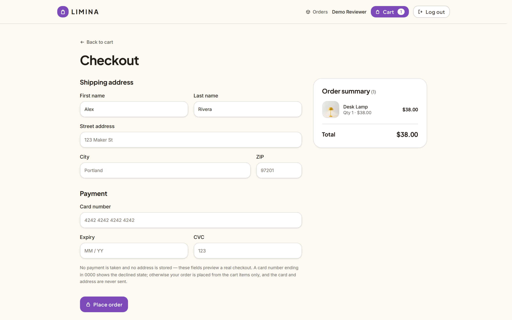
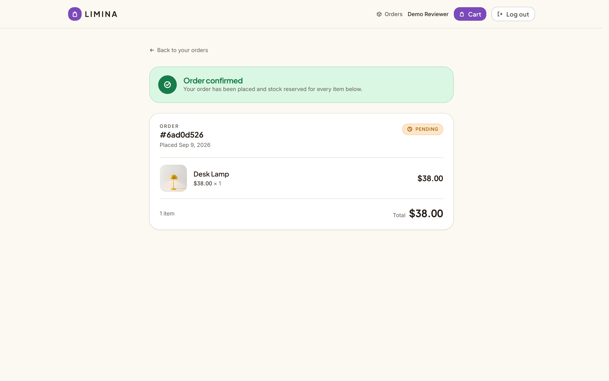
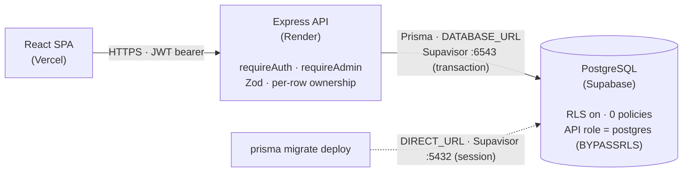

# Limina

A full-stack store — **Express + Prisma + PostgreSQL** API with a **React** SPA — built as a
backend-engineering exercise. The catalog and checkout are the demo; the point is the transaction
underneath it: stock that can't be oversold by concurrent checkouts, orders that stay truthful after
a price change, checkout that's safe to retry, and authorization enforced at the row level. Every
claim below is enforced in code **and covered by a test**, not asserted in a comment.

[](https://github.com/putanetwanthanasak/ecommerce_mini/actions/workflows/ci.yml)

## Live demo

| | |
|---|---|
| **Frontend** | https://ecommerce-mini-lyart.vercel.app |
| **API** | https://ecommerce-backend-7u06.onrender.com — health check `/health` |

> **The first request can take 30–50 seconds.** The API is on Render's free tier, which stops the
> container after ~15 minutes idle. It is not broken — the app says so instead of hanging, and the
> request completes. Everything after it is fast.

Every page sits behind a login and there is deliberately **no shared demo account** — checkout
decrements real stock, so a public login would leave the catalog sold out. Registering takes about
ten seconds.

## Screenshots

A walk through the buying flow the concurrency work sits under.

| | |
|---|---|
|  | **Catalog** (`/products`) — card grid with all three stock states at once: in stock, `1 LEFT` (amber), and out of stock. Search and category filter are held in the URL. |
|  | **Product detail** — image, price, quantity, add to cart. "Price and stock are confirmed by the server at checkout." |
|  | **Cart** (`/cart`) — client-side only; there is no cart API. It re-fetches each product on mount to surface stale-stock shortages without rewriting the quantity. |
|  | **Checkout** (`/checkout`) — a cosmetic shipping + card form. Nothing here is sent: `POST /api/orders` receives `{ productId, quantity }` per line and nothing else. |
|  | **Order** (`/orders/:id`) — post-checkout confirmation and history detail in one page. Line items render `priceAtPurchase` and the product thumbnail. |

## What this demonstrates

Each of these is the reason a specific piece of the code looks the way it does. Deeper reasoning,
as a numbered invariant list, is in **[CLAUDE.md](CLAUDE.md)**.

- **Concurrency-safe stock.** Prisma runs at `READ COMMITTED`, so two transactions can both read
  `stock = 1`, both pass an `if (stock < quantity)` check, and both decrement to `-1`. The fix is to
  fold the condition *into* the write — `updateMany({ where: { id, stock: { gte: qty } }, data: {
  stock: { decrement: qty } } })` — and treat a `count` of `0` as the lost race. **Verified:** a
  test seeds `stock = 1`, fires two orders through `Promise.all`, and asserts the two statuses are
  exactly `[201, 409]`, that one order row exists, and that final stock is `0`.
- **Deadlock prevention by sorted lock acquisition.** Every path that updates multiple product rows
  sorts by `productId` first, so all transactions take row locks in one global order and queue
  instead of forming a cycle. **Measured over 40 concurrent two-item orders:** without the sort, 8
  succeed and 32 die with Postgres deadlock errors; with it, 40 and 0.
- **Idempotent order creation.** `POST /api/orders` requires an `Idempotency-Key` header (a UUID,
  one per checkout attempt, reused across retries). The order transaction's *first* write claims
  that key on a `@@unique([userId, key])` index; a concurrent or network-level retry loses that race
  and replays the winner's stored response instead of placing a second order. The claim is a guarded
  write, not a pre-flight `SELECT` — same reasoning as the stock guard.
- **Money integrity.** `priceAtPurchase` is copied onto each order line *inside* the transaction,
  read from the product row — the request body has no price field. Repricing a product never
  rewrites what a past order was charged. Arithmetic uses `Prisma.Decimal` (`.add()`, `.mul()`),
  never floats; the column is `Decimal(10,2)`.
- **Row-level security with zero policies.** RLS is enabled on all six tables with **no policies at
  all** — deliberate, not a misconfiguration. Supabase exposes every `public` table through
  PostgREST to anyone holding the anon key; RLS on with no policies denies the `anon` and
  `authenticated` roles every row. The API connects as `postgres` (table owner, `BYPASSRLS`), so
  Prisma is unaffected. It ships as a migration, so CI applies it too.
- **Login rate limiting.** `express-rate-limit` on `POST /api/auth/login` only — 5 attempts per
  15-minute window, then `429`. Keyed on **IP + email**, not IP alone: a shared office or carrier
  NAT IP would otherwise lock out everyone behind it after five tries, whereas IP+email throttles
  the account actually under attack. Login returns an identical `401` for "unknown email" and "wrong
  password", so an attacker can't cheaply learn which addresses are worth spraying.

## Tech stack

| Layer | Choice | Why it's this and not the obvious alternative |
|---|---|---|
| Runtime | Node 22, TypeScript **5.7** | Pinned: `ts-node@10.9.2` (run by `ts-node-dev`) crashes on the TypeScript 7 API (`ts.sys` undefined). `@types/node` pinned to 22.10 for the same reason. |
| API | Express 5 | — |
| ORM | Prisma **6** (`^6.16`) | Pinned off 7: Prisma 7 drops `datasource { url = env(...) }` from the schema and requires a `prisma.config.ts` plus a driver adapter — a deliberate migration, not a version bump. |
| Validation | Zod 4 | Runs at the route boundary; every `ZodError` is rendered as one identical `400` by the error handler, so no route writes its own validation response. |
| Auth | JWT (`jsonwebtoken`) + bcrypt (`bcryptjs`) | 1-day bearer token. `app.ts` exports the configured app with no `.listen()` so Supertest drives it without binding a port. |
| Rate limiting | `express-rate-limit` 8 | Login route only; in-memory store. |
| Database | PostgreSQL (Supabase), `Decimal(10,2)` for money | **Two pooler modes, not one.** `db.<ref>.supabase.co` is IPv6-only and Render has no outbound IPv6, so all traffic goes through Supavisor. Runtime uses transaction mode (`:6543`); migrations use session mode (`:5432`, via `DIRECT_URL`) because Prisma Migrate's session-level advisory lock can't be held over transaction pooling — against `:6543`, `migrate deploy` *hangs indefinitely* rather than erroring. |
| Tests | Vitest + Supertest | Run against a real Postgres; each test deletes the rows it created, so the suite is order-independent and repeatable. |
| Frontend | React 19, Vite 8, Tailwind 4, React Router 7, TanStack Query 5 | Its own `package.json` and TypeScript (`~6.0`) — a separate package, no workspace tool or root manifest. |
| Deploy | API on Render, SPA on Vercel, DB on Supabase | `render.yaml` and `frontend/vercel.json` are committed; secrets are dashboard-only. See **[DEPLOYMENT.md](DEPLOYMENT.md)**. |

## Architecture

Two independently deployed apps in one repo (`backend/`, `frontend/`). The SPA holds a JWT in
`localStorage` and sends it as a bearer token; **every real authorization decision is the API's**.
Express middleware proves *who* (`requireAuth`) and *what role* (`requireAdmin`); per-row ownership —
"is this your order?" — is checked in the handler, because middleware structurally can't know it.
Prisma reaches Postgres through Supabase's transaction-mode pooler; migrations run through the
session-mode pooler. RLS is on at the database with no policies, closing the direct
PostgREST/anon-key path — the API's `postgres` role bypasses it.



Request path inside the API: `middleware → routes (validate → business rules → DB) → lib/prisma.ts`,
with any throw diverted to a single error handler that maps it to a status code.

## Running locally

Needs **Node 22** and a PostgreSQL database (local, or a free Supabase / Neon instance).

```bash
git clone https://github.com/putanetwanthanasak/ecommerce_mini.git
cd ecommerce_mini

# backend  →  http://localhost:4000
cd backend
npm install
cp .env.example .env            # fill DATABASE_URL, DIRECT_URL, JWT_SECRET
npx prisma generate
npx prisma migrate deploy       # apply committed migrations
npm run dev

# frontend →  http://localhost:5173   (separate terminal)
cd ../frontend
npm install
cp .env.example .env            # VITE_API_URL=http://localhost:4000
npm run dev
```

**Environment variables** (names only — see each `.env.example`):

| App | Required | Optional |
|---|---|---|
| `backend/` | `DATABASE_URL`, `DIRECT_URL` (same value as `DATABASE_URL` locally), `JWT_SECRET` | `CORS_ORIGINS` (defaults to `http://localhost:5173`), `PORT` (4000), `NODE_ENV` |
| `frontend/` | `VITE_API_URL` | — |

**On seed data:** `npm run seed` only backfills `imageUrl` on the four demo products *if they
already exist* — there is no catalog fixture in the repo, so a fresh database starts empty. Create
categories and products through the API as an `ADMIN` (promoted directly in the DB) or via Prisma
Studio (`npm run prisma:studio`).

`npm run dev` on the API uses `--transpile-only` and does **no type checking** — run `npx tsc
--noEmit` before committing. `VITE_API_URL` fails silently if unset: `src/lib/api.ts` throws at
module load, the bundler treats the rest of the app as dead code, and the build still exits 0. Check
content, not size — `grep -c "Sign in" frontend/dist/assets/*.js`.

## Testing

```bash
cd backend
npm test            # 31 tests, 4 files (auth · jwt · orders · products)
npx tsc --noEmit    # type check — CI runs this too
```

Tests hit a real Postgres and clean up their own rows, so they are repeatable and order-independent;
CI points them at an ephemeral Postgres service container. The two most interesting both live in
`orders.test.ts` and use `Promise.all` to issue genuinely concurrent requests:

- **`never oversells under concurrency: two requests for the last unit`** — seeds `stock = 1`, fires
  two orders at once, asserts the statuses are exactly `[201, 409]`, that exactly one order row
  exists, and that final stock is `0`.
- **`collapses two identical concurrent requests with the same key into one order`** — two
  `POST /api/orders` sharing one `Idempotency-Key`, asserts a single order and identical responses.

CI (`.github/workflows/ci.yml`) runs two parallel jobs: **backend** (Postgres service → `migrate
deploy` → `tsc --noEmit` → Vitest) and **frontend** (`oxlint` → `tsc -b` + `vite build`). The
frontend has no behavioural tests yet.

## What I'd add with more time

- **Rate limiting is login-only and in-memory.** `/register` is unthrottled (a weaker vector — no
  secret to guess); the counter store is per-process, so a multi-instance deploy would need Redis.
- **No refresh tokens.** A 1-day JWT can't be revoked; logout is client-side only. The token lives
  in `localStorage` — an accepted XSS exposure, with httpOnly cookies as the production answer.
- **No payment step.** Checkout's shipping + card form is cosmetic (a card ending `0000` previews a
  decline, entirely client-side); `PAID` is a status nothing sets from the UI.
- **No admin UI.** The `ADMIN` role is real and API-enforced, but operators use Prisma Studio and
  admins are promoted directly in the database. Customers can read orders but can't cancel one from
  the UI.
- **Product images are URL-only.** `Product.imageUrl` is a validated URL string with no upload
  pipeline; a dead link falls back to a neutral block.
- **Idempotency keys aren't pruned.** Each key and its response is stored; the rows are safe to
  delete after a few hours, but no job does it.
- **No status-transition rules beyond cancel** (`SHIPPED → PENDING` is currently legal) and **no
  structured logging** (`console.error` only; production wants request IDs).
- **No frontend tests.** The cart and checkout logic is factored into DOM-free pure modules
  (`cart/cartOps.ts`, `orders/checkoutError.ts`, `lib/money.ts`) as the place a suite would start.

## License & contact

Personal portfolio project — no open-source license is attached, and it isn't intended for reuse.

Built by [**@putanetwanthanasak**](https://github.com/putanetwanthanasak). Deeper docs live in the
repo: **[CLAUDE.md](CLAUDE.md)** (the authoritative invariant list) and
**[DEPLOYMENT.md](DEPLOYMENT.md)** (Render / Vercel / Supabase specifics).
